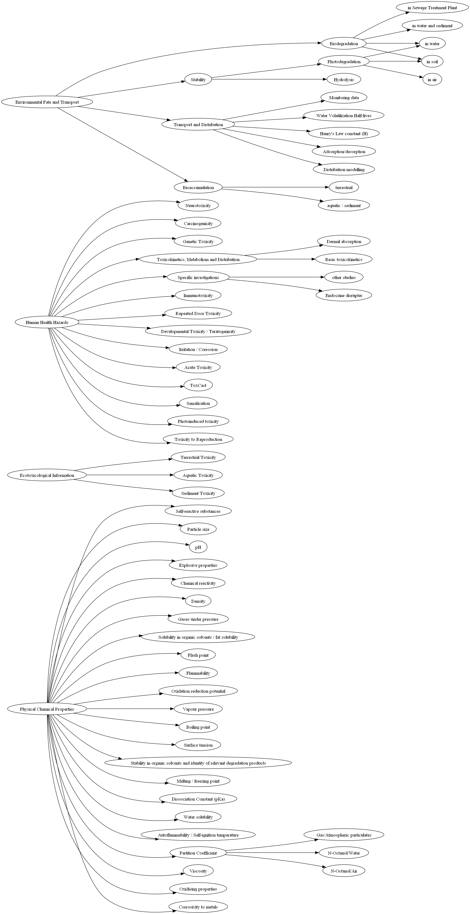

# Getting Started

This guide walks you through setting up and using the client effectively.

## Prerequisites

1. Install the official QSAR Toolbox application locally and start its Web API service.
2. Find the listening port of the local server (see below if unknown).

### Finding the Port Automatically

```python
import psutil, requests
from requests.exceptions import RequestException

def find_open_port(endpoint="/about/toolbox/version", host="127.0.0.1"):
    for conn in psutil.net_connections():
        if conn.status == "LISTEN" and getattr(conn.laddr, 'ip', host) == host:
            port = conn.laddr.port
            try:
                r = requests.get(f"http://{host}:{port}/api/v6{endpoint}", timeout=1)
                if r.status_code == 200:
                    return port
            except RequestException:
                continue
    return None

print("Detected port:", find_open_port())
```

## Instantiating the Client

```python
from pyqsartoolbox import QSARToolbox
qs = QSARToolbox(port=port_number, timeout=30) # use the port given by QSAR Toolbox Websuite
api_version = qs.webapi_version()
toolbox_version = qs.toolbox_version()
print(f"API version: {api_version}")
print(f"Toolbox version: {toolbox_version}")
```

## Endpoint tree

The following figure shows a graph of the end point tree:  


## Error Handling

Most methods raise ValueError with the HTTP status code if the API responds with an error. Wrap calls in try/except for resilience.

## Next Step

How to [search the databases](search_chemicals.md) for chemicals using different identifiers.
